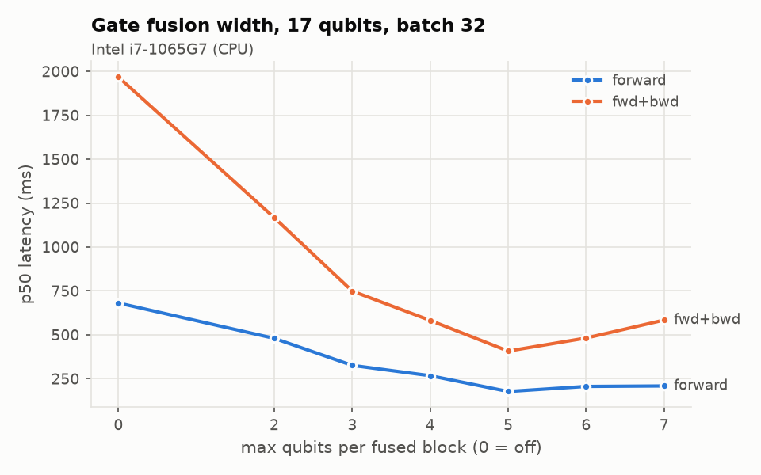
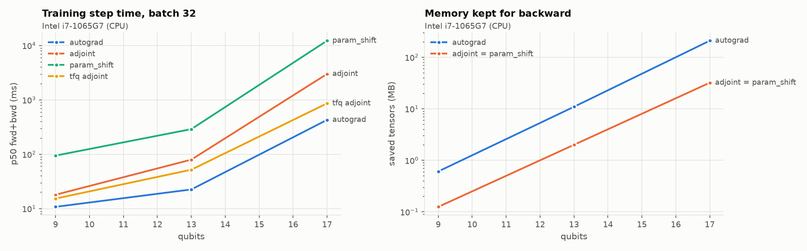

# qnnbench: profiling quantum neural networks in PyTorch

A batched state-vector simulator for quantum neural networks (QNNs), written in
plain PyTorch, plus the benchmarking, training and serving code around it. It
started as a university research project comparing a QNN with a classical
network on MNIST ([paper](docs/ResearchPaper.pdf)), built on TensorFlow Quantum.
I rebuilt it to answer the engineering questions behind that comparison: where
the time and memory go, and which trade-offs move them.

Simulating a quantum circuit is a sequence of small, memory-bound tensor
operations on a state of size 2ⁿ, so it is a compact testbed for GPU and
PyTorch performance work: kernel launch overhead, memory bandwidth, batching,
fusion, precision, and activation memory for the backward pass.

## Results

All numbers so far come from one laptop CPU (Intel i7-1065G7, 4 cores). GPU runs
are pending (see [Running on a GPU](#running-on-a-gpu)). Raw results with
environment metadata are in [`results/`](results).

### Performance: 17-qubit QNN, batch 32

| Change | Before | After | Why |
|---|---|---|---|
| Gate fusion, k=5 (forward) | 681 ms | **177 ms** (3.8×) | 35 passes over the state → 6 |
| Gate fusion (training step) | 1,968 ms | **408 ms** (4.8×) | also 5× less activation memory (1,060 → 209 MB) |
| Adjoint vs autograd (memory) | 209 MB | **32 MB** | one state at any depth, at 7× the time |
| complex64 vs complex128 | 413 ms | **209 ms** | half the bytes moved; max error 1.2e-6 |
| vs PennyLane `default.qubit` | 1,433 ms | **199 ms** | fused, batched kernels |
| vs TensorFlow Quantum (qsim, C++) | forward 145 ms / step 862 ms | forward 199 ms / **step 428 ms** | TFQ still wins the forward pass; this wins training and small circuits (2.0 vs 7.2 ms at 9 qubits) |
| Quanvolution: fold the fixed circuit into one unitary | 0.9M circuits/s | **4.7M circuits/s** | one GEMM per chunk instead of one kernel per gate |
| Serving, 16 clients: dynamic micro-batching | 75 req/s, p50 212 ms | **178 req/s, p50 88 ms** | about 8 requests share one forward pass |




**Things that didn't help, and why:**

- **`torch.compile` on the complex-valued simulator: no speedup** (199 vs 188 ms
  at 17 qubits, after 9 s of compiling). TorchInductor doesn't generate fused
  kernels for complex dtypes and falls back to eager ops. Splitting the state into
  real and imaginary float32 parts lets it fuse a single gate 3× faster (37.6 →
  12.2 ms, the `kernels` suite). Compiling a whole circuit that way took 80–220 s
  and didn't beat fused eager on CPU, so fusion was the better lever. It's worth
  revisiting on GPU.
- **Bigger batches on CPU stop paying off at batch 2.** At 17 qubits one state
  is 1 MB, which already saturates memory bandwidth (`batch` suite). On a GPU,
  where small batches are launch-bound, the curve should look different.
- **Serving at 64 clients:** throughput fell back to about 90 req/s with multi-second
  tails. Server metrics showed batches capped at about 8 and client p99 10× the
  server-side p99: the event loop, the load generator and torch's threads were
  fighting over 4 cores. Capping torch threads helped a little. This needs more
  compute, not batch tuning, and it led to the server's overload design: see
  [Serving under overload](#serving-under-overload).
- **int8 dynamic quantization of the hybrid model's Linear layers:** 2.4× smaller
  weights, same accuracy, but batch-1 CPU latency went *up* (0.24 → 0.35 ms).
  The model is small and conv-dominated, so quantizing activations on every call
  costs more than int8 Linear layers save.

### Accuracy

Paper protocol (3 epochs, batch 32, Adam), 5 seeds, independent models:

| Model | Params | Test accuracy | Range |
|---|---|---|---|
| QNN (500 training examples) | 32 | 73.6% ± 11.1 | 59.2–86.5% |
| QNN | 32 | 88.9% ± 2.1 | 86.2–90.7% |
| Fair MLP | 37 | **91.4% ± 0.3** | 91.0–91.8% |
| Lookup table (Bayes ceiling) | 193 patterns | 91.4% | deterministic |

Binarized 4x4 images take only 193 distinct values, so a majority vote per pattern
is the best any model can do on this input. The MLP reaches that ceiling; the QNN
doesn't, and it varies more across seeds. This reverses the paper's single-run
headline (see [below](#original-research-and-what-changed)).

**Quanvolutional preprocessing** (full 10-class MNIST, 5 epochs, same CNN head,
single seed): quantum filter **98.80%**, random classical 2x2 filter **98.93%**,
learned 2x2 filter **98.97%**. The random classical control is the important
row: here, the quantum filter adds nothing over a random projection of the same
shape.

## Running on a GPU

Every suite, the hybrid trainer and the server run on CUDA unchanged:
`python -m qnnbench.bench all --device cuda`. On GPU the harness switches to
CUDA-event timing and records peak device memory. The `exec` suite adds CUDA
graphs (`torch.compile(mode="reduce-overhead")`), and the quanvolution pipeline
overlaps host-to-device copies with compute on a side stream. These GPU-only
paths have not been run yet. The [`k8s/bench-job.yaml`](k8s/bench-job.yaml) Job
runs the full suite on one GPU node; pin `nvidia.com/gpu.product` to compare GPU
types.

## What's in the repo

| Path | What it does |
|---|---|
| [`src/qnnbench/sim/`](src/qnnbench/sim) | Batched state-vector simulator: gate kernels, gate fusion, three gradient methods |
| [`src/qnnbench/bench/`](src/qnnbench/bench) | Benchmark harness, 9 suites, regression checker, plots |
| [`src/qnnbench/train.py`](src/qnnbench/train.py), [`experiments.py`](src/qnnbench/experiments.py) | QNN and baseline training; multi-seed accuracy comparison |
| [`src/qnnbench/quanv.py`](src/qnnbench/quanv.py), [`hybrid.py`](src/qnnbench/hybrid.py) | Quanvolutional preprocessing and a hybrid CNN trainer (AMP, gradient accumulation, DDP, int8) |
| [`src/qnnbench/serve.py`](src/qnnbench/serve.py), [`loadtest.py`](src/qnnbench/loadtest.py) | FastAPI inference: micro-batching, load shedding, deadlines, graceful drain, Prometheus metrics; load test |
| [`src/qnnbench/profile.py`](src/qnnbench/profile.py) | `torch.profiler` traces of a training step with named circuit blocks (NVTX on CUDA) |
| [`configs/`](configs), [`src/qnnbench/config.py`](src/qnnbench/config.py) | TOML run configs (paper protocol, hybrid, DDP + accumulation) |
| [`tests/`](tests) | Simulator checked against Cirq; gradients against finite differences |
| [`Dockerfile`](Dockerfile), [`k8s/`](k8s), [`.github/`](.github) | GPU image; serving, benchmark and DDP/multi-node manifests ([notes](k8s/README.md)); CI, image publishing, Dependabot |
| [`legacy/tfq/`](legacy/tfq) | The original TensorFlow Quantum code, with the bugs fixed and documented |

## Quick start

```bash
make install        # locked deps (uv.lock), CPU PyTorch; on a GPU machine: make install-gpu
make hooks          # pre-commit: ruff, mypy, lockfile and large-file checks on each commit
make test           # under a minute on a laptop CPU
make bench-quick    # every suite at small sizes
make bench          # full suites -> results/<suite>/<device>.json
make profile        # trace of one training step -> runs/profile/trace.json (Perfetto)
python -m qnnbench.bench.plot   # -> docs/figures/
```

Runs are configured with TOML files; flags override the file:

```bash
python -m qnnbench.train --config configs/paper_protocol_qnn.toml --seed 3
torchrun --nproc-per-node 2 -m qnnbench.hybrid --config configs/hybrid_ddp_accum.toml
```

Run one suite on a GPU and compare two machines or commits:

```bash
python -m qnnbench.bench grad fusion --device cuda
python -m qnnbench.bench.compare results/grad/old.json results/grad/new.json --tolerance 0.15
```

## Engineering practices

### Serving under overload

Past saturation, every extra client only adds queueing delay, so an unbounded
queue turns overload into unbounded latency at flat throughput. That's what the
64-client CPU load test showed. The server now:

- refuses excess connections at the HTTP layer (`uvicorn --limit-concurrency`),
  where most of the waiting actually happened, before any parsing work;
- bounds its batch queue and answers `503` + `Retry-After` immediately when it
  is full;
- gives each request a deadline and drops expired requests *before* inference
  (`504`), so no GPU time goes to answers nobody is waiting for;
- drains on shutdown: `/readyz` turns `503`, queued work finishes, then the
  worker stops. Kubernetes pairs this with a `preStop` pause and a grace period
  ([k8s notes](k8s/README.md)).

### Observability

JSON-lines logs (`QNNBENCH_LOG_FORMAT=json`) with structured fields; Prometheus
histograms for request latency, batch size and per-batch inference time, plus
outcome-labelled request counters (`ok`, `shed`, `timeout`, `invalid`, `error`)
and a queue-depth gauge. The autoscaler scales on queue depth, not CPU.
`python -m qnnbench.profile` produces a `torch.profiler` timeline with each gate
and fused block as a named range (`--nvtx` for Nsight Systems on CUDA).

### Quality gates (CI, on every PR)

| Check | What it catches |
|---|---|
| ruff, `mypy --check-untyped-defs` | lint, formatting and type errors |
| pytest on Python 3.10 and 3.12, coverage floor 70% | regressions; the simulator is checked against Cirq |
| `uv sync --locked` | a lockfile out of date with `pyproject.toml` |
| `pip-audit` on the locked set | dependencies with known vulnerabilities |
| benchmark and profiler smoke runs | benchmark code that crashes (timings are gated on dedicated hardware with `qnnbench.bench.compare`, not on shared runners) |
| `kubeconform -strict` | invalid Kubernetes manifests, including the Kubeflow CRD |
| Docker build + Trivy | image build failures; image CVEs reported to the Security tab |

**Supply chain:** dependencies are locked (`uv.lock`); GitHub Actions are
pinned to commit SHAs; Dependabot opens weekly grouped updates, with PyTorch in
its own PR so it can be benchmarked before merging. Images are published to GHCR
as immutable `sha-<commit>` tags, and manifests pin a version, never `:latest`.

## Design notes

**Gate kernels.** A batch of states is a `(B, 2**n)` complex tensor. A gate on
qubits `a < b` reshapes it, as a view, to `(B·2**a, 2, 2**(b-a-1), 2, rest)` and
contracts the 2x2 or 4x4 gate along the two size-2 axes, so each gate is one
kernel over the whole batch. Diagonal gates (Z, CZ, ZZ, RZ) are a broadcast
multiply instead of a contraction.

**Gate fusion** ([`fusion.py`](src/qnnbench/sim/fusion.py)). Each gate reads and
writes the whole state while doing a few FLOPs per amplitude, so the simulator is
bandwidth-bound. Runs of diagonal gates fold into one batch-independent phase
vector; neighbouring dense gates fold into one k-qubit unitary applied as a single
GEMM. That trades 2ᵏ FLOPs per amplitude for fewer passes over memory, which is
why there is a best k rather than "fuse everything".

**Gradients** ([`statevector.py`](src/qnnbench/sim/statevector.py)):

| Method | Memory for backward | Compute | Note |
|---|---|---|---|
| autograd | one state per gate (or per fused block) | 1 forward + 1 backward | fastest on a simulator |
| adjoint (custom `autograd.Function`) | constant: ~3 states | about 2× the gate applications | memory doesn't grow with depth |
| parameter shift | constant | 2 forward passes per parameter | the only one that works on real quantum hardware |

**Correctness.** Every gate's unitary, random 5-qubit circuits, the full 17-qubit
QNN and the quanvolution filter are checked against `cirq.Simulator`. All three
gradient methods, with and without fusion, are checked against finite differences.
The benchmark comparing frameworks refuses to report a number if PennyLane or Cirq
disagree with this simulator.

**Measurement.** The harness warms up before timing, uses CUDA events on GPU (host
timers only see asynchronous launches), reports p50/p95 rather than one run,
records peak device memory, and measures autograd's saved-tensor bytes with
`saved_tensors_hooks`, so memory comparisons also work on CPU. Every result file
records git SHA, library versions and device properties.

## Original research and what changed

The paper reported a QNN at 90.6% test accuracy against 82.7% for a 37-parameter
classical network, and concluded QNNs had an edge. Rebuilding it surfaced two bugs
that produced that gap (details in [`legacy/tfq/README.md`](legacy/tfq/README.md)):

1. **The "full" QNN was warm-started.** Both QNN runs shared one Keras model, so it
   trained for 6 epochs, not 3.
2. **The classical baseline's accuracy was thresholded at 0.5 on logits** instead
   of 0, under-reporting it.

The code follows the [TensorFlow Quantum MNIST tutorial](https://www.tensorflow.org/quantum/tutorials/mnist),
which implements the QNN of [Farhi & Neven (2018)](https://arxiv.org/abs/1802.06002).
Paper authors: Shahaf Brenner, Anna Payne, Trinidad Roca, Juan Diego Fernandez,
Sergio Verdugo, Noah Valderrama and Pedro Torrado.
